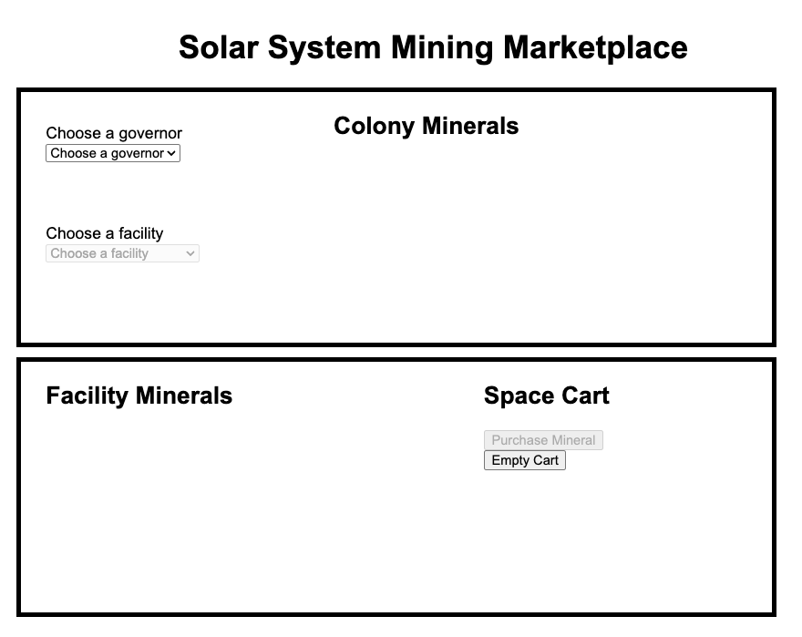

# EXOMINE

Let colonies purchase minerals from mining facilities.

## Description

The Solar System Mineral Marketplace is an application designed to facilitate mineral purchases among the colonies. By providing the most up-to-date colony and facility mineral data, purchase minerals with confidence!

## Getting Started

### Dependencies

* [Node.js](https://nodejs.org/en)
* [JSON server](https://www.npmjs.com/package/json-server)

### Installing

* [Exomine - Mining Marketplace](https://github.com/NSS-Day-Cohort-79/Exomine-client-pibikj)
* [Clone](https://docs.github.com/en/repositories/creating-and-managing-repositories/cloning-a-repository) the repository
* In terminal - access the repository directory

### Executing program

* Open two new tabs in your terminal  

    * In the first tab, `cd api`, then run the following command - 
        ```
        json-server -p 8088 -w database.json
        ```
    * In the second tab, run the `serve` command
        * In your browser, paste the local address
        ```
        http://localhost:3000
        ```



## Help

Please contact the authors below to report issues with the program.

## Authors

* [Cory Drumright](https://github.com/cmdrumright)
* [Jack Gardner](https://github.com/jackgardner99)
* [Larissa Ferreira](https://github.com/larisssssa)

## Version History

* 1.0
    * Order minerals for the colony, 1 ton at a time, one facility at a time.
* 1.1
    * Order multiple minerals from multiple facilities in one purchase!


## Acknowledgments

Inspiration, code snippets, etc.
* [awesome-readme](https://github.com/matiassingers/awesome-readme)
* [PurpleBooth](https://gist.github.com/PurpleBooth/109311bb0361f32d87a2)
* [dbader](https://github.com/dbader/readme-template)
* [zenorocha](https://gist.github.com/zenorocha/4526327)
* [fvcproductions](https://gist.github.com/fvcproductions/1bfc2d4aecb01a834b46)