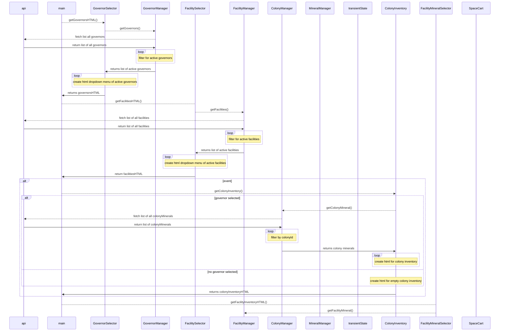

```mermaid

sequenceDiagram

participant api

participant main
participant GovernorSelector
participant GovernorManager
participant FacilitySelector
participant FacilityManager
participant ColonyManager
participant MineralManager

participant transientState

participant ColonyInventory

participant FacilityMineralSelector
participant SpaceCart

main-->>GovernorSelector: getGovernorsHTML()
GovernorSelector-->>GovernorManager: getGovernors()
GovernorManager-->>api: fetch list all governors
api->>GovernorManager: return list of all governors
loop
note over GovernorManager: filter for active governors
end
GovernorManager->>GovernorSelector: returns list of active governors
loop
note over GovernorSelector: create html dropdown menu of active governors
end
GovernorSelector->>main: returns governorsHTML

main-->FacilitySelector: getFacilitiesHTML()
FacilitySelector-->>FacilityManager: getFacilities()
FacilityManager-->>api: fetch list of all facilities
api->>FacilityManager: return list of all facilities
loop
note over FacilityManager: filter for active facilities
end
FacilityManager->>FacilitySelector: returns list of active facilities
loop
note over FacilitySelector: create html dropdown menu of active facilities
end
FacilitySelector->>main: return facilitiesHTML

alt event
main-->>ColonyInventory: getColonyInventory()
alt governor selected
    ColonyInventory-->>ColonyManager: getColonyMineral()
    ColonyManager-->>api: fetch list of all colonyMinerals
    api->>ColonyManager: return list of colonyMinerals
    loop
    note over ColonyManager: filter by colonyId
    end
    ColonyManager->>ColonyInventory: returns colony minerals
    loop
    note over ColonyInventory: create html for colony inventory
    end
else no governor selected
    note over ColonyInventory: create html for empty colony inventory
end
ColonyInventory->>main: returns colonyInventoryHTML
end

main-->FacilityMineralSelector: getFacilityInventoryHTML()
FacilityMineralSelector-->>FacilityManager: getFacilityMineral()

```
