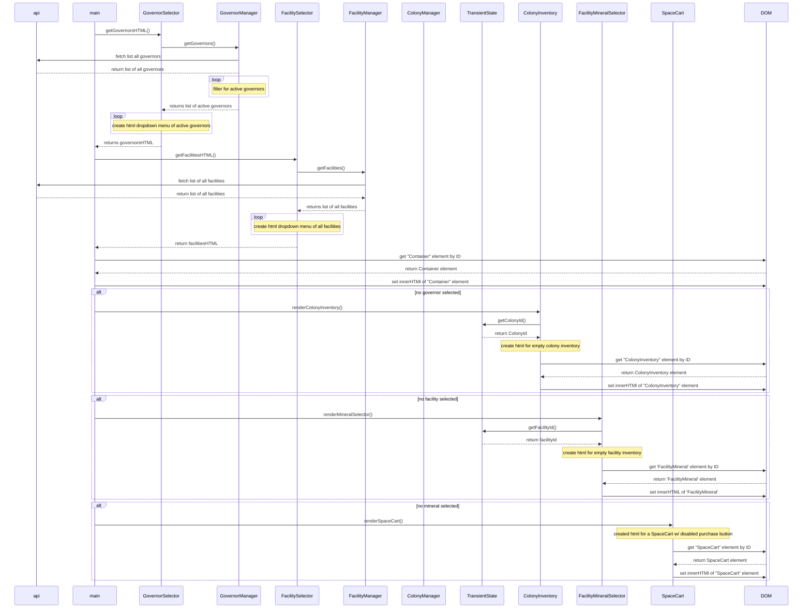
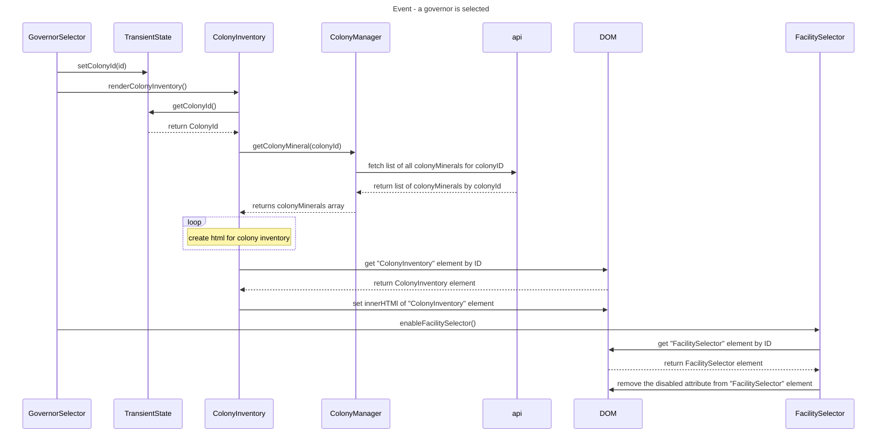
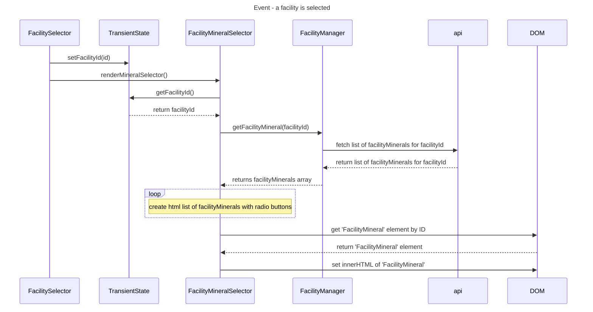
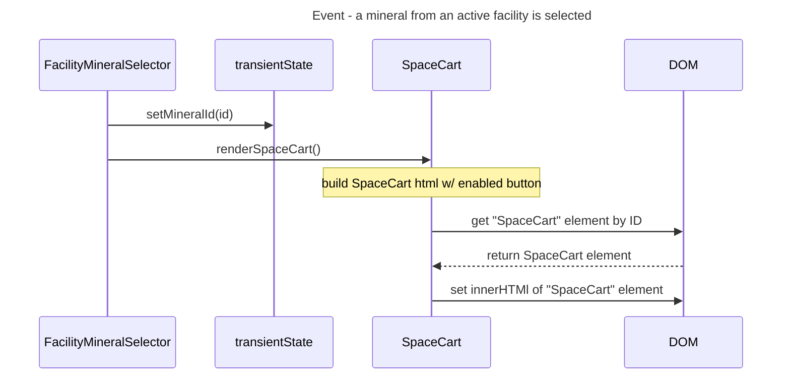
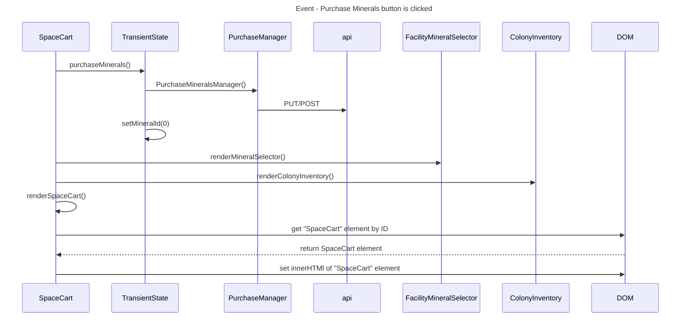

```mermaid

sequenceDiagram

participant api

participant main
participant GovernorSelector
participant GovernorManager
participant FacilitySelector
participant FacilityManager
participant ColonyManager

participant TransientState

participant ColonyInventory

participant FacilityMineralSelector
participant SpaceCart

main->>GovernorSelector: getGovernorsHTML()
GovernorSelector->>GovernorManager: getGovernors()
GovernorManager->>api: fetch list all governors
api-->GovernorManager: return list of all governors
loop
note over GovernorManager: filter for active governors
end
GovernorManager-->>GovernorSelector: returns list of active governors
loop
note over GovernorSelector: create html dropdown menu of active governors
end
GovernorSelector-->>main: returns governorsHTML

main->>FacilitySelector: getFacilitiesHTML()
FacilitySelector->>FacilityManager: getFacilities()
FacilityManager->>api: fetch list of all facilities
api-->>FacilityManager: return list of all facilities
FacilityManager-->>FacilitySelector: returns list of all facilities
loop
note over FacilitySelector: create html dropdown menu of all facilities
end
FacilitySelector-->>main: return facilitiesHTML

main->>DOM: get "Container" element by ID
DOM-->>main: return Container element
main->>DOM: set innerHTMl of "Container" element 

alt no governor selected
main->>ColonyInventory: renderColonyInventory()
ColonyInventory->>TransientState: getColonyId()
TransientState-->>ColonyInventory: return ColonyId
note over ColonyInventory: create html for empty colony inventory
ColonyInventory->>DOM: get "ColonyInventory" element by ID
DOM-->>ColonyInventory: return ColonyInventory element
ColonyInventory->>DOM: set innerHTMl of "ColonyInventory" element 
end

alt no facility selected
main->>FacilityMineralSelector: renderMineralSelector()
FacilityMineralSelector->>TransientState: getFacilityId()
TransientState-->>FacilityMineralSelector: return facilityId
note over FacilityMineralSelector: create html for empty facility inventory
FacilityMineralSelector->>DOM: get 'FacilityMineral' element by ID
DOM-->>FacilityMineralSelector: return 'FacilityMineral' element
FacilityMineralSelector->>DOM: set innerHTML of 'FacilityMineral'
end

alt no mineral selected
main->>SpaceCart: renderSpaceCart()
note over SpaceCart: created html for a SpaceCart w/ disabled purchase button
SpaceCart->>DOM: get "SpaceCart" element by ID
DOM-->>SpaceCart: return SpaceCart element
SpaceCart->>DOM: set innerHTMl of "SpaceCart" element 
end
```
--- 

``` mermaid

sequenceDiagram

Title: Event - a governor is selected

GovernorSelector->>TransientState: setColonyId(id)
GovernorSelector->>ColonyInventory: renderColonyInventory()
ColonyInventory->>TransientState: getColonyId()
TransientState-->>ColonyInventory: return ColonyId
ColonyInventory->>ColonyManager: getColonyMineral(colonyId)
ColonyManager->>api: fetch list of all colonyMinerals for colonyID
api-->>ColonyManager: return list of colonyMinerals by colonyId
ColonyManager-->>ColonyInventory: returns colonyMinerals array
loop
note over ColonyInventory: create html for colony inventory
end
ColonyInventory->>DOM: get "ColonyInventory" element by ID
DOM-->>ColonyInventory: return ColonyInventory element
ColonyInventory->>DOM: set innerHTMl of "ColonyInventory" element 
GovernorSelector->>FacilitySelector: enableFacilitySelector()
FacilitySelector->>DOM: get "FacilitySelector" element by ID
DOM-->>FacilitySelector: return FacilitySelector element
FacilitySelector->>DOM: remove the disabled attribute from "FacilitySelector" element 

```
---

``` mermaid

sequenceDiagram

Title: Event - a facility is selected
FacilitySelector->>TransientState: setFacilityId(id)
FacilitySelector->>FacilityMineralSelector: renderMineralSelector()
FacilityMineralSelector->>TransientState: getFacilityId()
TransientState-->>FacilityMineralSelector: return facilityId
FacilityMineralSelector->>FacilityManager: getFacilityMineral(facilityId)
FacilityManager->>api: fetch list of facilityMinerals for facilityId
api-->>FacilityManager: return list of facilityMinerals for facilityId
FacilityManager-->>FacilityMineralSelector: returns facilityMinerals array
loop
note over FacilityMineralSelector: create html list of facilityMinerals with radio buttons
end
FacilityMineralSelector->>DOM: get 'FacilityMineral' element by ID
DOM-->>FacilityMineralSelector: return 'FacilityMineral' element
FacilityMineralSelector->>DOM: set innerHTML of 'FacilityMineral'

```
---

``` mermaid

sequenceDiagram

Title: Event - a mineral from an active facility is selected

FacilityMineralSelector->>transientState: setMineralId(id)
FacilityMineralSelector->>SpaceCart: renderSpaceCart()
note over SpaceCart: build SpaceCart html w/ enabled button
SpaceCart->>DOM: get "SpaceCart" element by ID
DOM-->>SpaceCart: return SpaceCart element
SpaceCart->>DOM: set innerHTMl of "SpaceCart" element 

```
---

``` mermaid

sequenceDiagram

Title: Event - Purchase Minerals button is clicked

SpaceCart->>TransientState: purchaseMinerals()
TransientState->>PurchaseManager: PurchaseMineralsManager()
PurchaseManager->>api: PUT/POST
TransientState->>TransientState: setMineralId(0)
SpaceCart->>FacilityMineralSelector: renderMineralSelector()
SpaceCart->>ColonyInventory: renderColonyInventory()
SpaceCart->>SpaceCart: renderSpaceCart()
SpaceCart->>DOM: get "SpaceCart" element by ID
DOM-->>SpaceCart: return SpaceCart element
SpaceCart->>DOM: set innerHTMl of "SpaceCart" element 
```